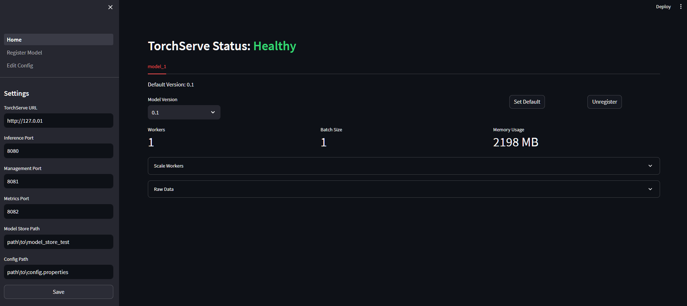

# TorchMenu

A simple [streamlit](https://github.com/streamlit/streamlit) web application to manage your model deployment with [TorchServe](https://github.com/pytorch/serve). It is designed to tap into your currently deployed TorchServe instance using its APIs.



Current features include:

- View loaded models, including their versions and metrics
- Model management: load, unload, and delete models
- Show and edit the server `config.properties` file

## Installation

```bash
pip install torchmenu
```

### Development

```bash
git clone https://github.com/williamcorsel/TorchMenu.git
cd TorchMenu
pip install -e .[dev]
pre-commit install
```

## Usage

To launch the application, run the following command:

```bash
torchmenu
```
